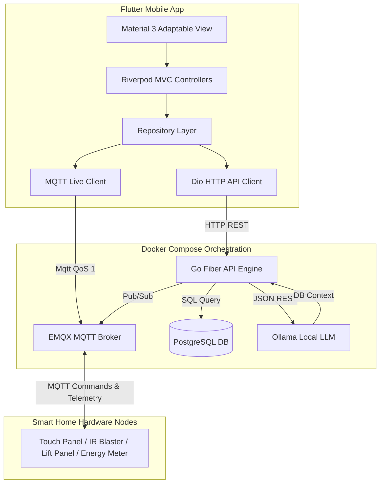

# Neuro Touch — Enterprise Smart Home Automation Platform

Welcome to **Neuro Touch**, a premium, production-ready smart home automation ecosystem designed for high responsiveness, local-first intelligence, and elegant usability. 

---

## 🛠️ Architecture & Core Components



### 1. Flutter Mobile App (Android/iOS)
- **State Management:** Riverpod 2.x for clean, reactive MVC architecture.
- **Navigation & Routing:** `go_router` supporting deep-linking and stateful shell routing (5-tab navigation).
- **Design System:** Adapts natively to System Light/Dark modes with curated color tokens (Dark: `#111844`, Light: `#ffffff`, Surface: `#F5F5F5`). Contains custom micro-animations (e.g. entrance fades, active filter pills, pulsing live telemetry scales).
- **MQTT Connectivity:** Persistent client connection using `mqtt_client` for real-time telemetry updates.

### 2. Go Backend Engine
- **Framework:** Go Fiber (v2) for maximum throughput and near-zero memory footprint.
- **ORM:** GORM (v2) with native PostgreSQL driver.
- **JWT Authentication:** Stateful user session management and auto-refresh mechanisms.
- **Local AI Concierge:** Resolves smart home contexts dynamically from the DB and pipes them into a local Ollama API prompt template (supports `llama3` out-of-the-box).
- **Telemetry Compactor:** Auto-compresses granular raw metrics into aggregated hourly averages after 24 hours, protecting DB sizing.

### 3. Messaging & Infrastructure
- **MQTT Broker:** EMQX v5 for sub-millisecond message dispatching.
- **Database:** PostgreSQL 16 (running on Alpine) with persistent volume mappings.
- **AI Backend:** Local Ollama container with offline capabilities.

---

## 📂 Codebase Directory Layout

```
.
├── backend/                       # Go Fiber REST API Source
│   ├── config/                    # DB, Env and config loaders
│   ├── controllers/               # Routing handlers (Auth, Devices, Sharing, Provisioning)
│   ├── middleware/                # JWT Auth and Cors middlewares
│   ├── models/                    # GORM PostgreSQL structural mappings
│   ├── routes/                    # API v1 endpoint maps
│   ├── seeds/                     # Matrix templates (IR brands database)
│   ├── services/                  # MQTT subscription engine, Compactor, Ollama link
│   ├── Dockerfile                 # Multi-stage static build instructions
│   └── go.mod                     # Go modules registry
├── emqx/                          # EMQX setup files
│   └── rule_engine_definitions.json
├── mobile/                        # Flutter Mobile App Workspace
│   ├── assets/                    # Shared assets and vectors
│   ├── lib/                       # Main Dart source
│   └── pubspec.yaml               # Flutter package registry
├── .env.example                   # Environment configuration blueprint
└── docker-compose.yml             # System integration compose stack
```

---

## 🚀 Deployment Guide (Ubuntu 24.04 LTS VPS)

### Prerequisite Setup
1. Log in to your target Ubuntu 24.04 server:
   ```bash
   ssh root@your_vps_ip
   ```
2. Update packages and install Docker:
   ```bash
   sudo apt update && sudo apt upgrade -y
   sudo apt install -y docker.io docker-compose-v2
   ```

### Application Launch
1. Clone the project onto the server.
2. Initialize config parameters:
   ```bash
   cp .env.example .env
   # Edit any keys or passwords (e.g. database credentials or custom JWT secret)
   nano .env
   ```
3. Spin up the containers using Docker Compose:
   ```bash
   docker compose up -d --build
   ```
4. Verify all components are healthy:
   ```bash
   docker compose ps
   ```

---

## 📡 MQTT Topic Hierarchy & Communication Manual

Communication uses QoS 1 for critical pings and commands:

- **Device Telemetry:** `neurotouch/devices/{deviceId}/telemetry/{metric}`
  - *Payload example:* `{"value": 24.5}` (voltage, current, power, energy, temperature, humidity...)
- **Device Status Publish:** `neurotouch/devices/{deviceId}/status`
  - *Payload example:* `{"status": "online"}` or `{"status": "offline"}`
- **Device Heartbeat Ping:** `neurotouch/devices/{deviceId}/heartbeat`
  - *Payload example:* `{"uptime": 3600, "firmware": "v1.0.1"}`
- **Server Dispatch Commands:** `neurotouch/devices/{deviceId}/command/{feature}`
  - *Features:* `switch`, `ir`, `lift`
  - *Switch Payload:* `{"switch_index": 1, "state": true}`
  - *IR Blaster Payload:* `{"button": "TEMP_22", "brand": "Daikin", "appliance": "ac"}`
  - *Lift Panel Payload:* `{"command": "up"}`
